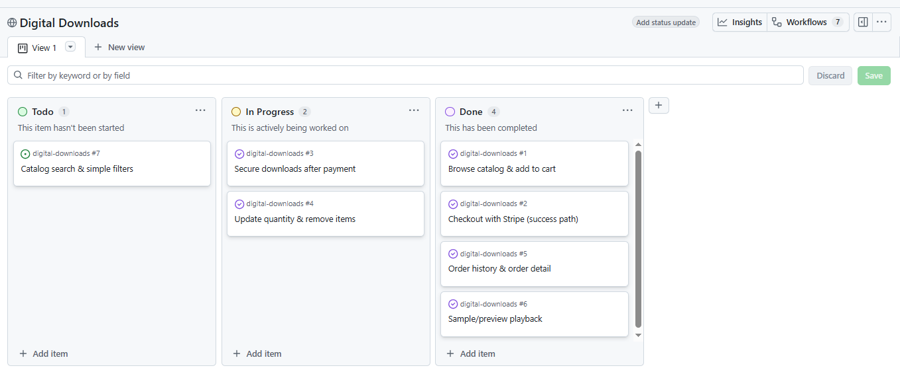
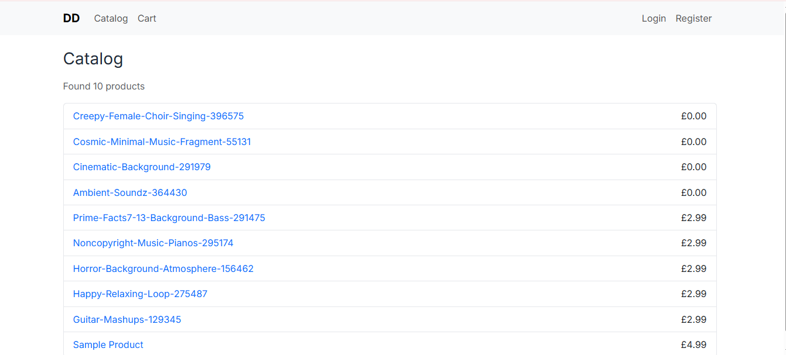
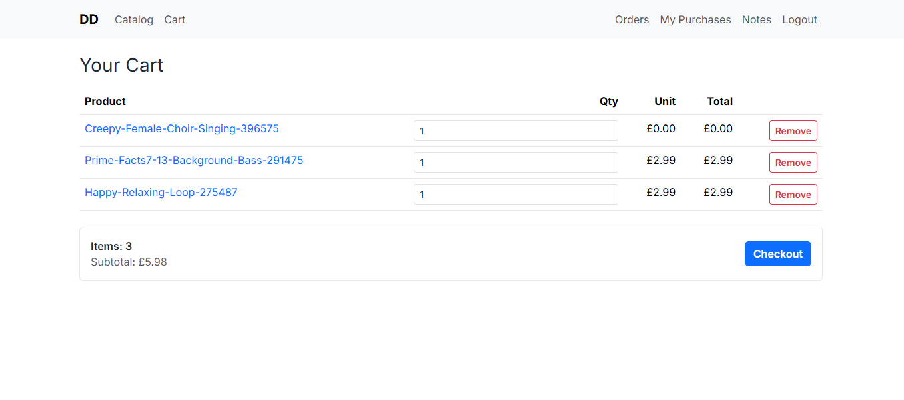
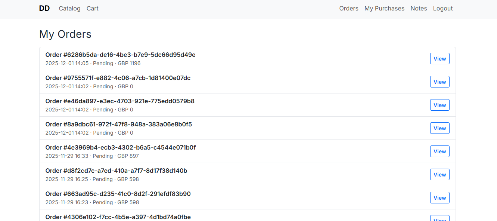
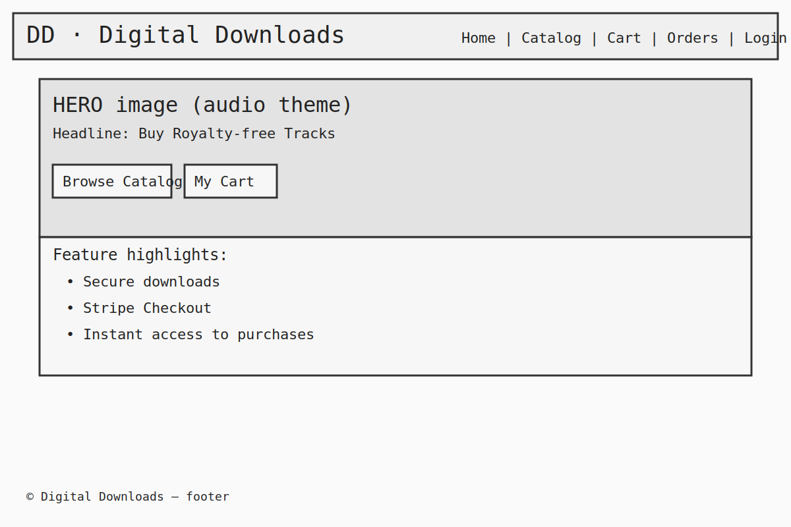
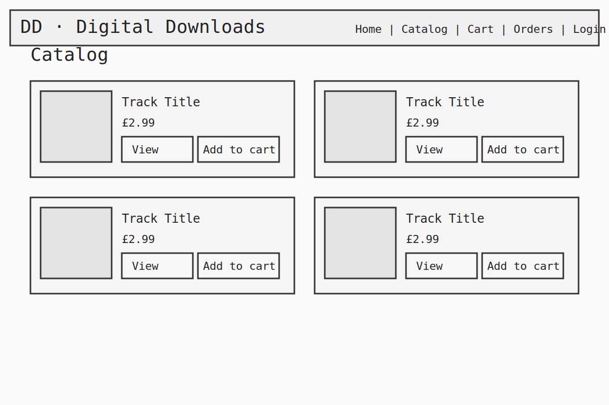
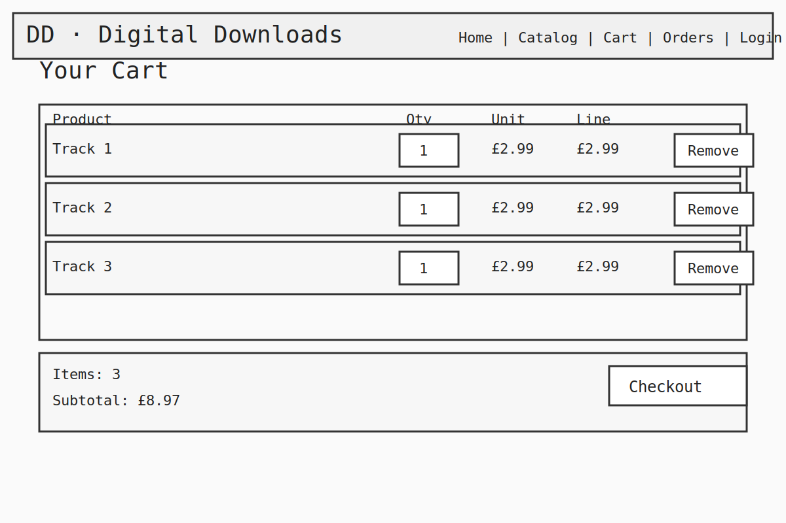
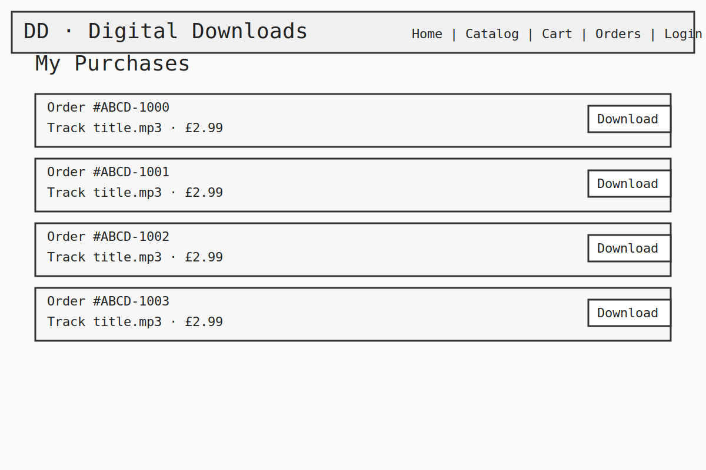
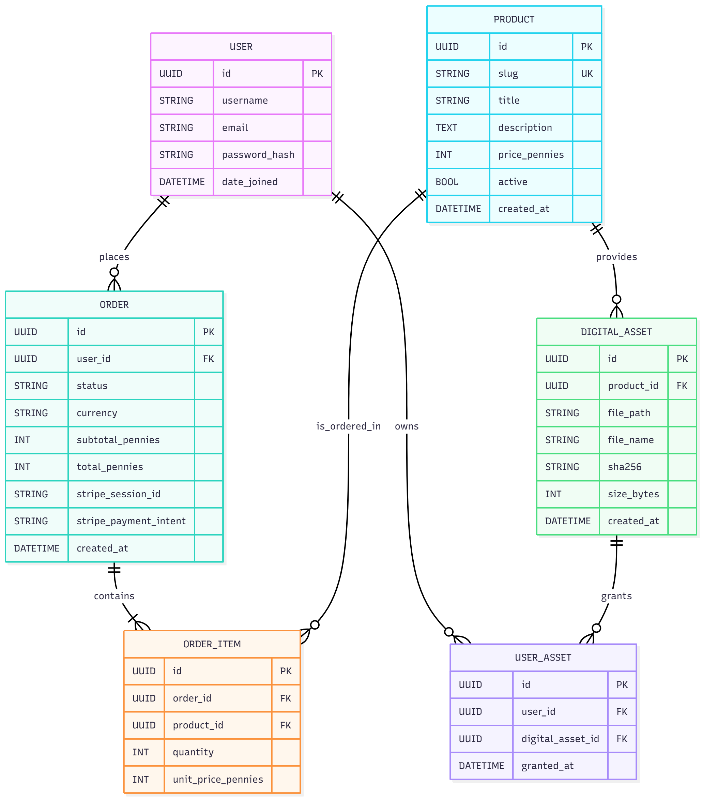
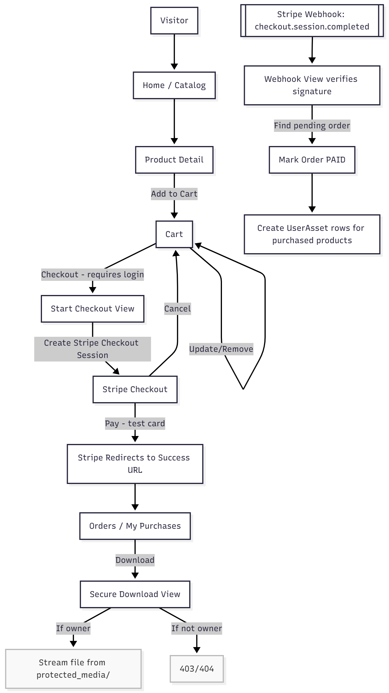

# Digital Downloads

**Digital Downloads** is a full‑stack Django web app that sells downloadable audio files (e.g., MP3s). Users browse a simple catalog, add items to a session cart, checkout via **Stripe Checkout**, and receive secure, permission‑checked downloads after payment is confirmed by a Stripe **webhook**. 

**Why**: Sell downloadable audio safely with Stripe and permission-checked downloads.  
**What**: Django 5 app with catalog → cart → Stripe Checkout → webhook → secure downloads.  
**How**: Minor-unit prices (pennies), non-public storage (`protected_media/`), tests, Heroku deploy.

---

The live link can be found here: [View the live project here](https://digital-downloads-7febd3d13d07.herokuapp.com/)

---


## Table of Contents

* [Digital-Downloads](#digital-downloads--secure-store-for-mp3s-django--stripe)

  * [Table of Contents](#table-of-contents)
* [Project-Structure](#project-structure)
* [Features](#features)
* [User-Experience-Design](#user-experience-design)

  * [The-Strategy-Plane](#the-strategy-plane)

    * [Site-Goals](#site-goals)
    * [Agile-Planning](#agile-planning)

      * [Epics](#epics)
      * [User-Stories](#user-stories)
  * [The-Scope-Plane](#the-scope-plane)
  * [The-Structure-Plane](#the-structure-plane)

    * [Features](#features-1)
    * [Features-Left-To-Implement](#features-left-to-implement)
  * [The-Skeleton-Plane](#the-skeleton-plane)

    * [Wireframes](#wireframes)
    * [Database-Design](#database-design)
    * [Security](#security)
  * [The-Surface-Plane](#the-surface-plane)

    * [Design](#design)
    * [Colour-Scheme](#colour-scheme)
    * [Typography](#typography)
    * [Imagery](#imagery)
* [Data-Model](#data-model)
* [Environment-Variables](#environment-variables)
* [Technolgies](#technolgies)
* [Code-Quality](#code-quality)
* [Testing](#testing)
* [Deployment](#deployment)

  * [Version-Control](#version-control)
  * [Heroku-Deployment](#heroku-deployment)
  * [Run-Locally](#run-locally)
  * [Fork-Project](#fork-project)

*[Credits](#credits)

## Project Structure

```
repo-root/
├─ README.md
├─ django-digital-downloads/
│  ├─ manage.py
│  ├─ config/                 # project settings/urls/wsgi
│  ├─ accounts/               # registration/login templates
│  ├─ catalog/                # Product model + list/detail views
│  ├─ cart/                   # session cart utils + views + templates
│  ├─ checkout/               # Stripe checkout start + webhook
│  ├─ orders/                 # Order/OrderItem/UserAsset + downloads
│  ├─ core/                   # home page, base template
│  ├─ templates/              # shared templates
│  ├─ static/                 # css/js/img (served by WhiteNoise)
│  └─ protected_media/        # NON-PUBLIC files (products/samples)
└─ docs/                      # screenshots, diagrams, scripts
```

## Features

* Browse catalog and product detail
* Add to cart, update quantities, remove items
* Cart totals in **pennies** rendered as £X.YY
* Stripe Checkout (server-created session)
* Webhook marks orders **paid** and grants **UserAsset** access
* My Purchases list with secure, permission-checked downloads
* Order detail page with line items and totals
* Minimal Bootstrap UI + small custom stylesheet

# User-Experience

* [Heroku-Deployment](#heroku-deployment)
* [Run-Locally](#run-locally)
* [Fork-Project](#fork-project)
* [Credits](#credits)

# User-Experience-Design

## The-Strategy-Plane

### Site-Goals

Digital Downloads helps users:

* Quickly preview a catalog of digital audio tracks and add them to a cart.
* Pay safely via **Stripe Checkout** (test mode locally, live in production).
* Access **only** the files they purchased via a secure, permission‑checked download endpoint.

Secondary goals for the site owner:

* Keep the UX extremely lightweight and mobile‑first.
* Ensure safe handling of paid files using a non‑public storage location (`protected_media/`).
* Provide an easy deployment pipeline to Heroku with a stable, well‑tested Django backend.

### Agile-Planning

This project was built iteratively over small commits, back-end to front-end, focusing first on a working cart/checkout flow, then on polish and docs.

A Kanban board was created using GitHub Projects and can be located here: [Kanban Board Link](https://github.com/users/Chia-Codes/projects)



#### Epics

**EPIC 1 – Base Setup**

Set up the Django project, apps, base templates, static handling, and initial models. Shipping a skeleton quickly unblocked later features.

**EPIC 2 – Catalog & Cart**

Product list/detail pages and a session‑backed cart with add/update/remove.

**EPIC 3 – Checkout (Stripe)**

Create a Stripe Checkout Session from the cart, redirect, and verify payment via a webhook.

**EPIC 4 – Secure Downloads**

After payment confirmation, grant access to the user via `UserAsset` records and a secured download view that streams from `protected_media/`.

**EPIC 5 – Deployment**

Ship to Heroku: static via WhiteNoise, Postgres, config vars, and webhook endpoint.

**EPIC 6 – Documentation & Tests**

README, testing instructions, fixtures, and smoke tests for key flows.

#### User-Stories

**EPIC 1 – Base Setup**

* As a developer, I want a clean `base.html` so all templates inherit a consistent layout.
* As a developer, I want a simple home page with a clear CTA to the catalog.
* As a developer, I want models/migrations organized by app (catalog/orders/cart/checkout).

**EPIC 2 – Catalog & Cart**

* As a user, I can browse products and see prices clearly (in GBP).
* As a user, I can add a product to the cart and later adjust/remove it.
* As a user, I can see the cart totals and proceed to checkout only when the cart isn’t empty.

**EPIC 3 – Checkout (Stripe)**

* As a user, I’m redirected to Stripe’s hosted checkout and can pay with test cards.
* As the system, I receive a webhook on `checkout.session.completed` and mark the order paid.

**EPIC 4 – Secure Downloads**

* As a user, I can see my purchases under **My Purchases** and download the files I own.
* As the system, I never expose `protected_media/` directly; access is permission‑checked per request.

**EPIC 5 – Deployment**

* As a developer, I can deploy to Heroku and configure Stripe/DB via config vars.

**EPIC 6 – Documentation & Tests**

* As a developer, I have docs for local setup, env vars, and webhook testing.
* As a developer, I have pytest coverage for cart utils and the webhook flow.

## The-Scope-Plane

* Mobile‑first responsive UI (Bootstrap)
* Catalog list and detail view
* Session cart (add/update/remove)
* Stripe Checkout + webhook
* Purchases page (owned assets) & Order detail page
* Secure downloads from `protected_media/`
* Local dev with SQLite; Heroku with Postgres

## The-Structure-Plane

### Features

`USER STORY – As a user, I want to browse products and add to cart`

**Catalog List & Detail**

Users browse products with title and price. Detail pages include an **Add to cart** action.



`USER STORY – As a user, I want to update/remove items in the cart and see totals`

**Cart**

The cart shows each line’s qty, unit price, and calculated subtotal. Users can update qty or remove items.



`USER STORY – As a user, I want to pay securely and receive my downloads`

**Checkout & Webhook**

On **Checkout**, a Stripe Checkout Session is created server‑side. After successful payment, the Stripe webhook marks the `Order` as `paid` and grants `UserAsset` permissions so the user can access **My Purchases**.


`USER STORY – As a user, I want to see and download files I own`

**Purchases**

A protected page lists the purchased assets. Download links stream the file only for the owning user.



 **Note**: `protected_media/` is **not** served as static; downloads are streamed after permission checks.

## The Strategy Plane

### Site Goals
- Let users quickly browse MP3 products, add to cart, and pay securely.
- Ensure downloads are permission-checked and never exposed via `/static/`.
- Keep the UI lightweight and mobile-first.

### Agile Planning (1 week)
- Tracked in GitHub Projects (Kanban).  
  Board: https://github.com/users/Chia-Codes/projects  
- MoSCoW prioritisation; MVP delivered first (cart → checkout → secure download).

#### Epics
1. **Base Setup** – project, apps, base templates, auth, static.
2. **Catalog & Cart** – list/detail, add/update/remove, totals.
3. **Checkout (Stripe)** – checkout session + webhook; order marked paid.
4. **Secure Downloads** – grant `UserAsset`, download endpoint.
5. **Deployment** – Heroku, Postgres, WhiteNoise.
6. **Docs & Tests** – README, TESTING.md, smoke/unit tests.

### Features-Left-To-Implement

* Optional audio preview player on product detail pages
* Search/filter for catalog
* Download count & review limiting
* Receipt emails on purchase
* Object storage (S3) backend for large files (production)

## The-Skeleton-Plane

### Wireframes

* Home View



* Catalog View



* Cart View



* Checkout/Purchases



### Database-Design

## Database Schema



## Submission Flow



Core models used by the app:

* **Product** — `id`, `slug` (unique), `title`, `description`, `price_pennies` (int), `active` (bool)
* **DigitalAsset** — `id`, `product` (FK → `Product`), `file_path` (relative to `protected_media/`), `file_name`, `sha256`, `size_bytes`
* **Order** — `id`, `user` (FK → `auth.User`), `status` (`pending`/`paid`), `currency`, `subtotal_pennies`, `total_pennies`, `stripe_session_id`, `stripe_payment_intent`, timestamps
* **OrderItem** — `id`, `order` (FK), `product` (FK), `quantity`, `unit_price_pennies`
* **UserAsset** — grants a user access to a digital asset for a purchased product

**Constraints & Indexes**

* Prices stored in minor units (pennies) to avoid float errors
* `Product.slug` unique for clean URLs
* Ownership enforced through `UserAsset` lookups in download view

## Data Model

The logical relationships are:

* One **Product** → many **DigitalAsset** (usually one mp3 per product in this demo)
* One **Order** → many **OrderItem**
* One **User** ↔ many **Order**
* One **User** gains access to a **DigitalAsset** through **UserAsset** after successful checkout

Field defaults and nullability follow Django best practices; see each app’s `models.py` for exact definitions.

## The-Surface-Plane

### Design

Clean, minimal Bootstrap UI with a tiny custom stylesheet (`static/css/style.css`) to tweak font, headings, buttons, and spacing. Home page features a hero with an image and CTA to the catalog.

### Colour-Scheme

A simple, neutral palette with a primary accent (Bootstrap’s primary) and subtle grays for borders/backgrounds.

### Typography

Uses **Google Font** See `static/css/style.css` for the `@import` and small global tweaks.

## Technolgies

* **HTML** — Django templates
* **CSS** — Bootstrap 5 + tiny custom `style.css`
* **JavaScript** — a sprinkle for cart AJAX (optional)
* **Python** — Django backend
* **Visual Studio Code** — development
* **GitHub** — source control hosting
* **Git** — version control
* **WhiteNoise** — static files in production
* **Gunicorn** — WSGI server (Heroku)
* **Stripe** — Checkout + webhook

**Python/Django**

* Function‑based views for cart endpoints and checkout start/webhook
* `login_required` for purchases and order detail
* `pre-commit` hooks: `black`, `isort`, `flake8`

**External Python Modules**
See `requirements.txt` (Django 5, stripe>=6, dj-database-url, python-dotenv, gunicorn, whitenoise, pytest, pytest-django, etc.)

## Testing

For a full manual/automated test plan with accessibility, responsiveness, Lighthouse, and known issues, see [TESTING.md](TESTING.md)

Test cases and results can be found in the dedicated tests under each app (e.g., `checkout/tests/test_webhook.py`, `cart/tests/test_utils.py`).

# Pytest

**Example:** `core/tests/test_smoke.py`

```python
import pytest
from django.urls import reverse

@pytest.mark.django_db
def test_home_page(client):
    resp = client.get(reverse("core:home"))
    assert resp.status_code == 200
```

Run locally:

```bash
pytest -q
```

If you see “no tests ran”, ensure `pytest.ini` exists alongside `manage.py` and contains:

```ini
[pytest]
DJANGO_SETTINGS_MODULE = config.settings
python_files = tests.py test_*\.py *_tests.py
addopts = -q
```

---

Manual testing covered:

* Registration/login/logout flows
* Add/update/remove items in cart; totals update
* Stripe test checkout (success/cancel)
* Webhook confirms paid orders and grants access
* Purchases page lists downloads; downloads require login & ownership

---

### Unfixed Bugs

#### Issue #1: Manifest static errors when `collectstatic` not run

* **Symptoms:** ValueError: Missing staticfiles manifest entry for assets after renames
* **Workaround:** Ensure `collectstatic` runs. Keep asset paths in templates in sync.

#### Issue #2: Currency formatting differences in templates

* **Symptoms:** Minor‑unit vs decimal display inconsistencies if custom filters are changed
* **Workaround:** Use a single helper/filter to render pennies → `£X.YY` consistently.

#### Issue #3: Filesystem on Heroku

* **Symptoms:** Files written at runtime disappear between dyno restarts
* **Workaround:** Ship only demo files in Git or move to object storage (S3) for production

#### Issue #4: Catalog shows only one sample product on Heroku

- **Symptoms:** Production catalog lists only `sample-track`; locally you see multiple products.
- **Common causes:**
  - Demo MP3s weren’t actually deployed because they weren’t committed under `django-digital-downloads/protected_media/products/` (blocked by `.gitignore`).
  - Heroku database has only the seeded sample row; the ingest script wasn’t run to create additional `Product` + `DigitalAsset` records.
  - `DigitalAsset.file_path` stored incorrectly — it must be **relative to** `protected_media/` (e.g., `products/foo.mp3`, not an absolute path or leading slash).
  - Files uploaded at runtime vanished after a dyno restart (Heroku’s ephemeral filesystem).
- **Fix / Workarounds tried but failed:**
  1) Commit a few **small** demo MP3s under `django-digital-downloads/protected_media/products/` and push (ensure `.gitignore` has allow rules for `products/**`).
  2) On Heroku, run migrations and then seed data (run your ingest script from the repo or create Products/Assets via Django Admin).
  3) Verify each `Product` has `active=True` and prices set, and that every `DigitalAsset.file_path` is relative to `protected_media/`.
  4) For production scale, move assets to object storage (e.g., S3) and store pointers in the DB; don’t rely on runtime uploads on Heroku.

# Recently Fixed

* Cart remove and update endpoints now support both JSON (AJAX) and normal link flows
* Checkout button disabled when cart is empty
* Price rendering aligned to use pennies across cart/order templates

**UF-4: Heroku catalog initially showed one “sample-track”**
- Fixed by committing demo MP3s under `django-digital-downloads/protected_media/*` and running the ingest command on Heroku (see Deployment). Documented to avoid ephemeral filesystem pitfalls.

---

## Environment Variables

| Variable                | Example                                                         | Purpose                                        |
| ----------------------- | --------------------------------------------------------------- | ---------------------------------------------- |
| `SECRET_KEY`            | `dev-change-me`                                                 | Django secret; rotate if leaked                |
| `DEBUG`                 | `True/False`                                                    | Development vs production mode                 |
| `ALLOWED_HOSTS`         | `127.0.0.1,localhost,digital-downloads.herokuapp.com`           | Host protection                                |
| `SITE_BASE_URL`         | `http://127.0.0.1:8000`                                         | Used for Stripe success/cancel URLs            |
| `STRIPE_PUBLIC_KEY`     | `pk_test_...`                                                   | Stripe publishable key                         |
| `STRIPE_SECRET_KEY`     | `sk_test_...`                                                   | Stripe secret key                              |
| `STRIPE_WEBHOOK_SECRET` | `whsec_...`                                                     | To verify webhook signatures                   |
| `STRIPE_CURRENCY`       | `GBP`                                                           | Currency code (lowercased when sent to Stripe) |
| `CSRF_TRUSTED_ORIGINS`  | `http://127.0.0.1:8000,https://digital-downloads.herokuapp.com` | CSRF origin allowlist                          |
| `DATABASE_URL`          | Provided by Heroku Postgres                                     | Production DB                                  |

> Local dev reads from `.env` (via `python-dotenv`). On Heroku, use **Config Vars**.

## Code Quality

* **pre-commit** with:

  * **Black** (formatting)
  * **isort** (imports; `profile = "black"` via `pyproject.toml`)
  * **Flake8** (linting)
* **pytest / pytest-django** for tests (`pytest.ini` beside `manage.py`)
* Type hints sprinkled across views/utils for editor support
* Consistent currency rendering helpers in templates

## Deployment

### Version-Control

The site is developed in VS Code and pushed to GitHub in the `digital-downloads` repository.

Common git commands used during development:

```bash
git add <file>
git commit -m "commit message"
git push
```

### Heroku-Deployment

1. Create a Heroku app.
2. Add **Heroku Postgres** (Hobby Dev) from the Resources tab.
3. In **Settings → Config Vars**, set:

   * `SECRET_KEY` – your Django secret
   * `DATABASE_URL` – populated by the Postgres add‑on
   * `DEBUG` – `False`
   * `ALLOWED_HOSTS` – `digital-downloads.herokuapp.com`
   * `STRIPE_PUBLIC_KEY` / `STRIPE_SECRET_KEY` – test or live keys
   * `STRIPE_WEBHOOK_SECRET` – from the endpoint you create below
   * `STRIPE_CURRENCY` – e.g. `GBP`
   * `SITE_BASE_URL` – e.g. `https://digital-downloads.herokuapp.com`
   * `CSRF_TRUSTED_ORIGINS` – `https://digital-downloads.herokuapp.com`
4. WhiteNoise is included in `MIDDLEWARE` for production.
5. Connect to GitHub and deploy the `main` branch.
6. Migrate: `heroku run --app <app> python django-digital-downloads/manage.py migrate`

**Stripe Webhook Setup**

* Endpoint URL: `https://<your-app>.herokuapp.com/checkout/webhook/`
* Listen to: `checkout.session.completed`
* Copy the **Signing secret** into `STRIPE_WEBHOOK_SECRET`.

**Seed sample products locally**

Place demo MP3s in `django-digital-downloads/protected_media/products/` and run the ingest script (see `docs/scripts/ingest_mp3s.py`) to create `Product` + `DigitalAsset` rows.

### Run-Locally

```bash
git clone https://github.com/Chia-Codes/digital-downloads.git
cd digital-downloads/django-digital-downloads
python -m venv .venv
source .venv/Scripts/activate        # Windows PowerShell: .venv\\Scripts\\Activate.ps1
pip install -r requirements.txt
cp .env.example .env                  # create and fill; see Environment Variables
python manage.py migrate
python manage.py runserver
```

Open [http://127.0.0.1:8000/](http://127.0.0.1:8000/)

**.env example**

```
SECRET_KEY=dev-change-me
DEBUG=True
ALLOWED_HOSTS=127.0.0.1,localhost
SITE_BASE_URL=http://127.0.0.1:8000
STRIPE_PUBLIC_KEY=pk_test_...
STRIPE_SECRET_KEY=sk_test_...
STRIPE_WEBHOOK_SECRET=whsec_...
STRIPE_CURRENCY=GBP
CSRF_TRUSTED_ORIGINS=http://127.0.0.1:8000
```

### Fork-Project

Most commonly, forks are used to either propose changes to someone else’s project or to use someone else’s project as a starting point for your own idea.

* Navigate to the GitHub repository you want to fork.
* Click **Fork** in the top‑right corner.
* This will create a copy of the project in your GitHub account.

## Credits

* [Django](https://www.djangoproject.com/) — Web framework for models, views, templates, auth, admin.
* [Stripe](https://stripe.com/docs/payments/checkout) — Hosted Checkout + webhooks.
* [Bootstrap 5](https://getbootstrap.com/) — Layout, grid, components, responsive utilities.
* [WhiteNoise](https://whitenoise.evans.io/en/stable/) — Static files in production (hashed manifests).
* [Gunicorn](https://gunicorn.org/) — WSGI server.
* [Pixabay](https://pixabay.com/) — Royalty‑free images and audio (credited in captions).
* [psycopg / Postgres](https://www.psycopg.org/) — Production DB driver.
* [pytest / pytest‑django](https://docs.pytest.org/) — Test runner.
* [Black / isort / flake8](https://github.com/psf/black) — Code quality.
* [Heroku](https://www.heroku.com/) — App hosting and deployment.
* [MDN Web Docs](https://developer.mozilla.org/) — HTML/CSS/JS reference.
* [Slack](https://slack.com/)
* [Favicon](favicon.io)
* [Gareth Mcgirr Projects](https://github.com/Gareth-McGirr)
* [Code Institue Walk Throughs](https://learn.codeinstitute.net/)
* [Mermaid](https://mermaid.live/)

---

> **Notes for Maintainers**
>
> * For large files in production, prefer object storage (e.g., S3) instead of committing to the repo. Keep only placeholders/samples in Git.
> * Rotate all secrets if they are ever committed; Django secret key and Stripe keys should be considered compromised once public.
> * When adding new static assets, always run `collectstatic` before deploying to production.


