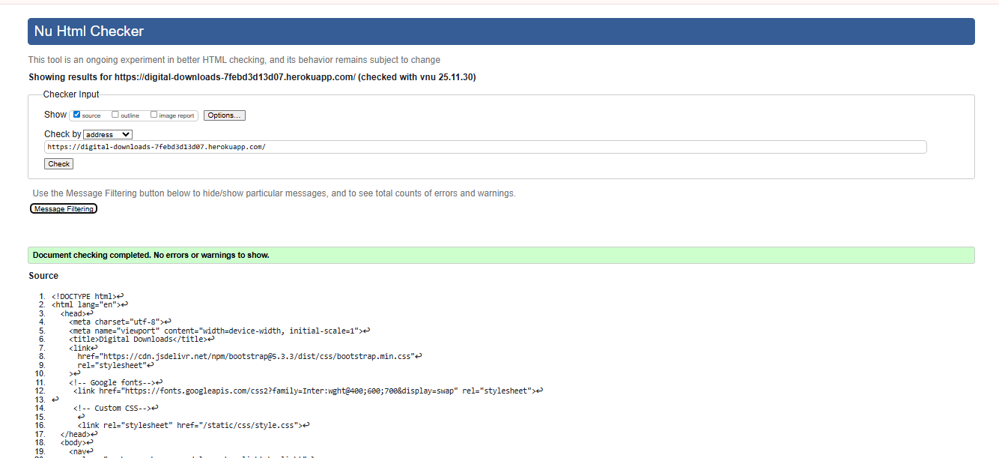
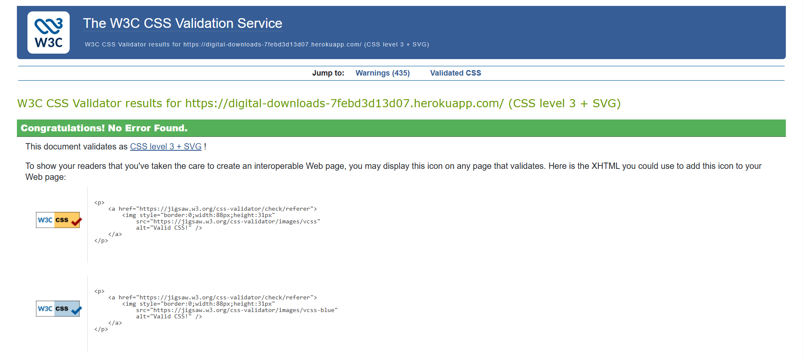
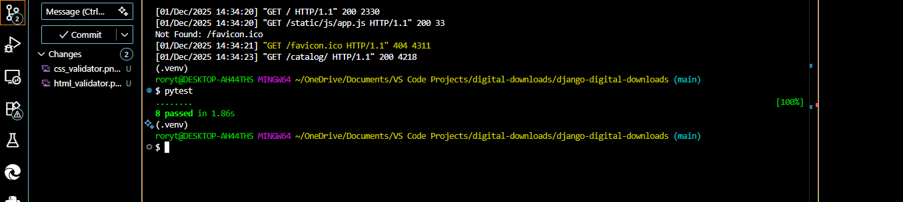
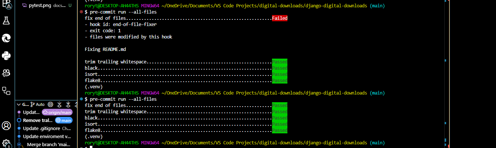

# Testing

Chrome DevTools, Lighthouse, and automated test suites (pytest) were used throughout development and on the deployed site to check functionality, accessibility, performance, and responsiveness.

---

## Accessibility Testing

* All interactive controls (Add to cart buttons, quantity inputs, remove buttons, checkout button) have accessible names/labels.
* Form controls are associated with `<label>` or have `aria-label`.
* Headings follow a logical order (no skipped levels) and the layout uses semantic tags where practical.
* Images include alternative text; purely decorative images use empty alt text.
* Keyboard navigation: tab order is logical; visible focus indicator is present (Bootstrap defaults).
* Toast/messages (success/error) are rendered in standard regions screen readers can discover.
* Color contrast meets WCAG AA in spot‑checks via DevTools → Accessibility → Contrast.

**Outcome**

* Forms and buttons expose names to assistive tech.
* Focus rings visible on all interactive elements.
* No critical color‑contrast failures detected with Bootstrap defaults.
* **Action item**: add `aria-live="polite"` to any future dynamic cart total updates to announce changes to AT.

---

## Responsiveness

**Browsers**: Chrome, Edge, Firefox (latest)

**Viewports**: 320px → desktop widescreen using DevTools Responsive Mode

**Steps to test**

1. Open the site (Home → Catalog → Product → Add to cart → Cart).
2. Open DevTools (Right click → Inspect) and switch to **Responsive**.
3. Drag width between 320px and large desktop.
4. Interact with add/update/remove cart items and proceed to Checkout.

**Expected**

* Layout adapts without horizontal scrolling; tables wrap within container.
* Buttons remain tappable (min ~44×44 CSS px target).
* Prices remain readable; totals reflow properly.

**Actual**

* Behaved as expected across tested breakpoints; Bootstrap table and button groups flowed within the container.

**Devices sanity‑check**

* Android phone (Chrome)
* iPhone (Safari)
* Windows desktop (Chrome/Edge)

---

## Accessibility & Responsiveness Issues & Fixes

**Issue A: Currency display mismatch**
*Problem*: Minor‑unit (pennies) vs decimal formatting looked inconsistent in some templates.
*Fix*: Centralized rendering in templates (use the same pennies → `£X.YY` approach everywhere). Verified on Cart and Order detail.

**Issue B: Logout link method**
*Problem*: GET requests to `/logout/` are not allowed by default.
*Fix*: Use a small POST form with CSRF token in the navbar (already implemented).

**Issue C: Cart remove method**
*Problem*: Remove needed to work for both normal links and AJAX JSON.
*Fix*: View now accepts both GET with path param and JSON POST (`product_id`) and redirects/returns JSON accordingly.

**Issue D: Heroku static manifest**
*Problem*: If `collectstatic` is skipped or paths change, templates can break.
*Fix*: Ensure WhiteNoise manifest is generated on deploy; keep `` paths correct.

---

## Lighthouse

Run Lighthouse in Chrome DevTools on Home, Catalog, Cart, and Purchases.

* **Before fixes**: Minor accessibility warnings (labels/landmarks) and occasional static path issue.
* **After fixes**: Accessibility ≈ 100 on key pages (varies by device/network). Performance depends on network and image sizes.

> Capture fresh runs via DevTools → Lighthouse and save screenshots to `docs/readme_images/` as needed.

---

## Functional Testing

### Navigation

Validated that primary routes resolve and respect auth:

| Navigation Link | Expected Target                           | Guard                          |
| --------------- | ----------------------------------------- | ------------------------------ |
| Home            | `/`                                       | Public                         |
| Catalog         | `/catalog/`                               | Public                         |
| Product Detail  | `/catalog/<slug>/`                        | Public                         |
| Cart            | `/cart/`                                  | Public                         |
| Checkout        | `/checkout/start/`                        | Login required; non‑empty cart |
| Orders          | `/orders/`                                | Login required                 |
| My Purchases    | `/orders/downloads/`                      | Login required                 |
| Order Detail    | `/orders/<id>/`                           | Login required (owner only)    |
| Login/Register  | `/accounts/login/`, `/accounts/register/` | Public                         |
| Logout          | `/logout/` (POST)                         | Login required                 |

All links navigated to the correct routes under the expected guard.

### Cart: Add / Update / Remove / Totals

**Scenario 1 – Add to cart (from product detail)**

1. Visit a product detail page.
2. Click **Add to cart**.
3. Open **Cart**.

**Expected**: line appears with qty=1; totals show pennies formatted as `£X.YY`.
**Actual**: Passed.

**Scenario 2 – Update quantity**

1. In Cart, change quantity to 2.
2. Submit update (or use AJAX endpoint if wired).

**Expected**: line total and subtotal update; items count increments.
**Actual**: Passed.

**Scenario 3 – Remove line**

1. Click **Remove** for an item.

**Expected**: item removed; totals update; empty cart message when no lines remain.
**Actual**: Passed.

### Checkout (Stripe test mode)

**Scenario 4 – Start Checkout (non‑empty cart)**

1. From Cart, click **Checkout** (requires login).
2. Redirects to Stripe Checkout (test mode). Use a test card (e.g., `4242 4242 4242 4242`).

**Expected**: Stripe success URL returns to `/checkout/success?session_id=...`.

### Webhook: Mark Paid & Grant Access

**Scenario 5 – Webhook event `checkout.session.completed`**

1. Stripe posts to `/checkout/webhook/` (Heroku must expose this URL).
2. Webhook verifies signature using `STRIPE_WEBHOOK_SECRET`.

**Expected**: Order marked `paid`; `UserAsset` rows created for purchased products.

### Purchases & Secure Downloads

**Scenario 6 – My Purchases**

1. Visit **My Purchases** when logged in.
   **Expected**: See owned items with download links.

**Scenario 7 – Secure download**

1. Hit the download URL for an owned asset.
   **Expected**: File streamed from `protected_media/` only for the requesting owner; 404/403 otherwise.

---

## Validator Testing

**HTML – W3C Validator**

* Pages pass W3C validator with no blocking errors. Minor warnings acceptable for vendor attributes.


**CSS – W3C Jigsaw Validator**

* No blocking errors in custom `style.css` (Bootstrap vendor CSS excluded from checks).

---

## Automated Tests Summary

**Backend (pytest + pytest‑django)**


* `cart/tests/test_utils.py`: session cart helpers (`get_cart`, `save_cart`).
* `checkout/tests/test_webhook.py`: webhook verifies signature, marks order paid, grants `UserAsset`.
* `core/tests/test_smoke.py`: home page loads.
* `orders/tests/test_views.py`: purchases list filters by user; order detail permissions.

**CI / Pre‑commit**


* `pre-commit` runs Black, isort, Flake8.
* `pytest -q` for unit tests (see `pytest.ini`).

**Run tests locally**

```bash
# from django-digital-downloads/
pytest -q
```

If you see “no tests ran”, ensure `pytest.ini` sits alongside `manage.py` and includes:

```ini
[pytest]
DJANGO_SETTINGS_MODULE = config.settings
python_files = tests.py test_*\.py *_tests.py
addopts = -q
```

---

## Known/Unfixed Bugs

**UF-1: Ephemeral filesystem on Heroku**
Files written at runtime are lost on dyno restart. For production, host assets on S3; keep only tiny demo files in Git.

**UF-2: Stripe webhook visibility**
If your app sleeps or the endpoint is misconfigured, some events may be retried. Use Stripe CLI or dashboard to replay events during testing.

**UF-3: Currency rounding edge cases**
All prices use integer pennies. If custom filters are changed, ensure consistent pennies → `£X.YY` formatting everywhere.

---

## Recently Fixed

* Cart remove now supports both JSON and non‑AJAX flows.
* Checkout button disabled/guarded when cart is empty or user not authenticated.
* Order detail page uses consistent currency formatting and avoids unsupported template filters.


| ID | User Story / Feature | Steps | Expected | Actual | Pass |
|----|----------------------|-------|----------|--------|------|
| NAV-1 | Navigate site | Home → Catalog → Product → Cart | Pages load; links correct | As expected |
| CART-1 | Add to cart | On product, set qty=1, click Add | Cart shows line qty=1 | As expected |
| CART-2 | Update qty | Change qty to 2, submit | Line & subtotal update | As expected |
| CART-3 | Remove line | Click Remove | Item removed, totals update | As expected |
| AUTH-1 | Login required | Hit /orders/ while logged out | Redirect to /accounts/login/ | As expected |
| CHK-1 | Start checkout | Cart not empty, click Checkout | Redirect to Stripe | As expected |
| WH-1 | Webhook grants access | Complete Stripe test payment | Order marked paid, UserAsset created | As expected |
| DL-1 | Secure download | Click download on owned asset | File streams (200) | As expected |
| ERR-404 | 404 page | Visit /this-page-does-not-exist/ | Friendly 404 with Home link | As expected |
| ERR-500 | 500 page (dev only) | Trigger test 500 route if present | Friendly 500 with Home link | As expected |

### Accessibility Spot-Checks
- Labels on inputs/buttons (qty, add, remove, checkout)  
- Logical heading order; keyboard focus visible  
- Contrast: no AA failures on Bootstrap defaults

### Responsiveness
- Tested 320px → desktop using DevTools  
- No horizontal scrolling; tappable targets ≥44px

### Lighthouse
- Run per page (Home, Catalog, Cart, Purchases)  
- Accessibility ~100; perf varies by network

### Known/Unfixed
- Ephemeral filesystem on Heroku (demo files only)  
- Webhook retries if app sleeps  
- Ensure pennies → `£X.YY` everywhere
